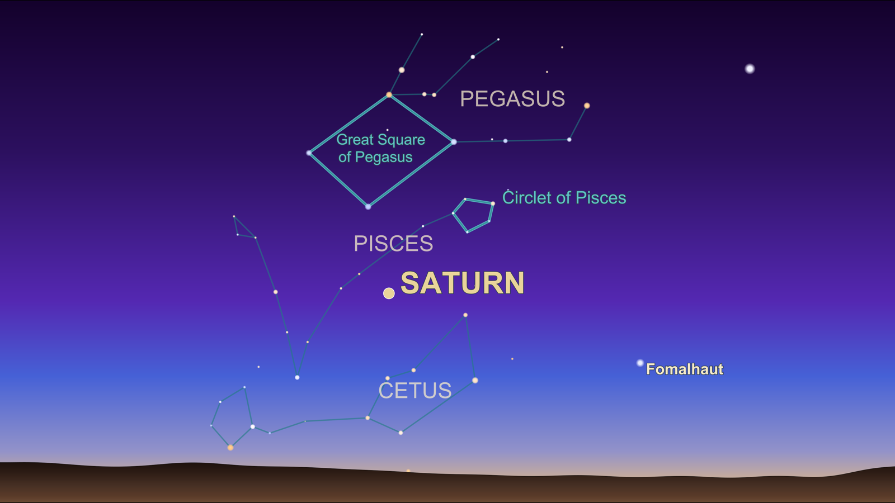
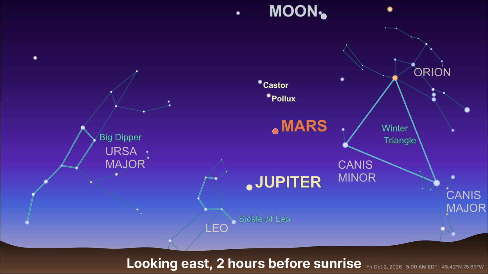

# horizonchart

Clean, 16:9 horizon-view sky charts built on [starplot](https://starplot.dev):

- **Finder charts** for planets, the Moon, stars or deep-sky objects at a given
  place and time, showing just enough context (nearby constellations,
  asterisms, bright stars) to find them.
- **Twilight views** for a date: the sky before sunrise and after sunset,
  looking east or west, whichever has more to see.





## Install

Requires Python 3.11+.

```sh
pip install horizonchart
```

or, from a checkout, with [uv](https://docs.astral.sh/uv/): `uv sync`.

### System requirement: Cairo

starplot renders PNGs with [CairoSVG](https://cairosvg.org), which needs the
Cairo graphics library installed on the system:

| Platform | Install |
|---|---|
| macOS | `brew install cairo` |
| Debian / Ubuntu | `sudo apt install libcairo2` |
| Fedora | `sudo dnf install cairo` |
| Windows | see [CairoSVG's notes](https://cairosvg.org/documentation/#installation) (a GTK runtime provides it) |

On macOS, Pythons that don't look in Homebrew's library folder (such as
uv-managed or python.org builds) may report `no library called "cairo" was
found`; point them at it with
`export DYLD_FALLBACK_LIBRARY_PATH=/opt/homebrew/lib`.

### Data files

The first run downloads star and deep-sky catalogs and planetary ephemerides
(~120 MB). They, and the place-name cache, are stored in the first of:

1. `$STARPLOT_DATA_PATH`, if set
2. `/var/data`, if it exists and is writable
3. the per-user cache folder for your platform (e.g.
   `~/Library/Caches/horizonchart` on macOS, `~/.cache/horizonchart` on Linux,
   `%LOCALAPPDATA%\horizonchart\Cache` on Windows)

## Command line

### Finder chart for specific objects

```sh
horizonchart target Saturn --location "Raleigh, NC" --time "2026-10-02 22:00"
# -> saturn_20261002T2200_35.78N_78.64W.png

horizonchart target Moon Pleiades -l "35.78N 78.64W" -t "2026-10-03 02:00"
```

Targets can be:

| Kind | Examples |
|---|---|
| Moon and planets | `Moon`, `Mars`, `Saturn`, `"saturn barycenter"` (BSP-style naming), `Pluto` |
| Messier / NGC / IC | `M31`, `M45`, `"NGC 1976"`, `"IC 2391"` |
| Deep-sky common names | `Pleiades`, `"Andromeda Galaxy"`, `Beehive` |
| Named stars | `Vega`, `Betelgeuse` |

`--time` is local time at the location (default: now). Each target must be
above the horizon at that time.

### Twilight views for a date

```sh
horizonchart twilight --location "Ottawa, ON" --date 2026-10-02
# -> 20261002T0500_45.42N_75.69W_mor.png, 20261002T2030_45.42N_75.69W_eve.png
#    (both moved to 2 hours from the Sun because planets were low at 1 hour)
```

| Option | Meaning |
|---|---|
| `-d, --date` | Date (default: today at the location) |
| `-m, --limiting-magnitude` | Faintest stars and deep-sky objects shown. Default 2.0 (suburban twilight); 4–6 for dark skies |

### Common options

| Option | Meaning |
|---|---|
| `-l, --location` | Coordinates (`35.78,-78.64`, `35.78N 78.64W`) or a place name (`"Raleigh, NC"`, `"Ottawa, ON"`) |
| `--tz` | Time zone name; by default it's looked up from the location |
| `-o, --output-dir` | Where to write PNGs (default: current directory) |

Place names are looked up with OpenStreetMap's
[Nominatim](https://nominatim.org) service, at most one request per second,
and cached (`horizonchart-geocode.json` in the data folder), so each place is
looked up once. Coordinates never touch the network. Nominatim's
[usage policy](https://operations.osmfoundation.org/policies/nominatim/)
asks applications to identify themselves; set `HORIZONCHART_CONTACT` (e.g. to
your email address) to include a contact in the request's user agent.

## Python

```python
from datetime import date, datetime
from zoneinfo import ZoneInfo

from horizonchart.skyview import plot_targets, plot_twilight_views

plot_targets(35.7796, -78.6382, ["Saturn"],
             datetime(2026, 10, 2, 22, 0, tzinfo=ZoneInfo("America/New_York")))

plot_twilight_views(35.7796, -78.6382, date(2026, 10, 2))
# {"morning": Path(...), "evening": Path(...)}
```

## How charts are composed

**Both chart types**

- Planet and Moon markers are drawn in roughly their naked-eye colors.
  Uranus, Neptune and Pluto are drawn smaller and semi-transparent.
- Asterisms (Great Square, Big Dipper, Summer Triangle, Orion's Belt, …) are
  highlighted and labeled. When an asterism is essentially its whole
  constellation (Cassiopeia's W, the Little Dipper), only the constellation is
  named.
- Easily recognized constellations (Orion, Ursa Major and Minor, Cassiopeia,
  Cygnus, Scorpius, Leo, Crux) are shown whenever most of the figure is in
  view.
- At most five stars are labeled, chosen from a priority list of well-known
  names (Polaris, Sirius, Betelgeuse, Vega, …). Other stars are unlabeled.

**Finder charts**

- Constellations are shown only if they contain a target, border it within
  3°, or are home to a highlighted asterism.
- The view is framed automatically around the targets and asterisms.

**Twilight views**

- Each view is 1 hour before sunrise or after sunset, rounded to the half
  hour. If planets or the Moon are low then, 2 hours is tried and used if it
  shows more.
- Each view looks east or west, scored by what's in view (planets, the Moon,
  deep-sky objects, asterisms, bright stars).
- The title, e.g. "Looking east, 1 hour before sunrise", is drawn on the
  landscape. The date, time and location are in small text in the lower
  right.

Tuning constants (radii, magnitudes, font sizes, the asterism and
priority-star lists) are at the top of `src/horizonchart/skyview.py`.

## Compatibility with starplot

horizonchart draws its charts with starplot's public API, but a few features
rely on starplot internals that have no public equivalent yet: keeping labels
clear of highlighted asterism lines, detecting whether a label was placed,
and converting coordinates for those checks. Because of this, the dependency
is pinned to the tested starplot release series (`>=0.21.1,<0.22`); newer
starplot releases need checking before the pin is raised.

## Tests

```sh
uv run pytest
```

The tests render real charts (Saturn from Raleigh on 2026-10-02, twilight
views for the same date), download the catalogs on first run, and take a
minute or two.

## Credits

- [starplot](https://starplot.dev) by Steve Berardi does the chart drawing,
  projections and catalogs (stars from Hipparcos/Tycho via its Big Sky
  catalog, deep-sky objects from [OpenNGC](https://github.com/mattiaverga/OpenNGC)).
  The horizon-view style follows its
  [horizon gradient example](https://starplot.dev/examples/horizon-gradient/).
- [Skyfield](https://rhodesmill.org/skyfield/) by Brandon Rhodes computes
  sunrise and sunset, planetary magnitudes and alt/az positions, using JPL
  ephemerides.
- Place-name lookup uses [Nominatim](https://nominatim.org) through
  [geopy](https://geopy.readthedocs.io); geocoding data
  © [OpenStreetMap](https://www.openstreetmap.org/copyright) contributors.
- Time zones come from [timezonefinder](https://github.com/jannikmi/timezonefinder).
- Titles use the [Inter](https://rsms.me/inter/) typeface by Rasmus Andersson,
  bundled under the SIL Open Font License (`src/horizonchart/fonts/OFL.txt`).

## License

MIT; see [LICENSE](LICENSE). The bundled Inter font is under the SIL Open Font
License 1.1.
